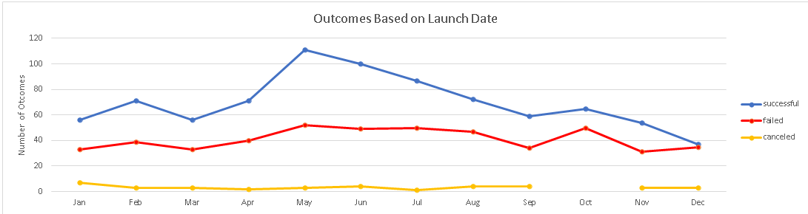
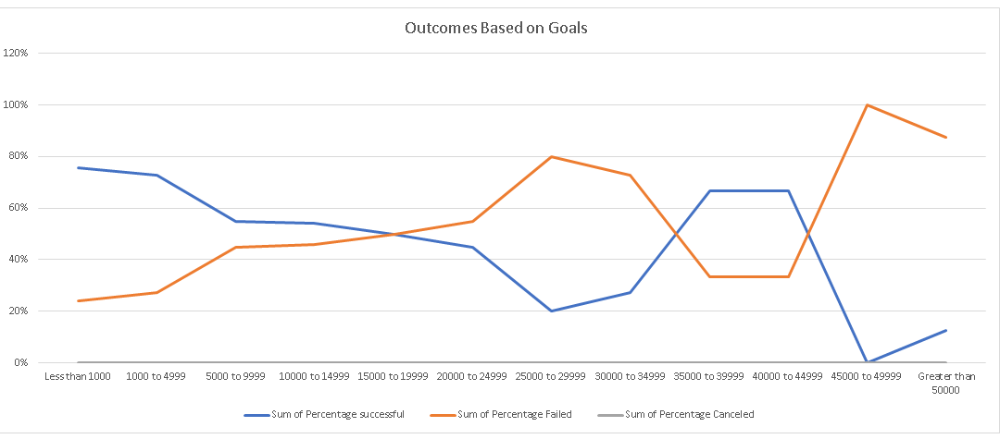

# Kickstarting with Excel

## Overview of Project

### Purpose
Our client Louise’s play *Fever* came close to its Kickstarter fundraising goal. Louise would like to know how other fundraising campaigns went based on their launch dates and funding goals.

## Analysis and Challenges

### Analysis of Outcomes Based on Launch Date

We created a pivot table of our Kickstarter data. We filtered the data based on the theater category. The data based on the months is collected using the outcomes as our values. The result is in figure 1 below.

**Figure 1**: Line graph of the relationship between the campaign launch date and campaign outcomes for the theater category.

### Analysis of Outcomes Based on Goals

We created a new table based on goal amounts in increments of $5000. Using the countifs function, the number of successful, failed, and canceled outcomes for each increment are collected. The percentage for each outcome is created by comparing the total outcomes of each goal amount with each outcome. With this data, we created a line graph as seen in figure 2 below.

**Figure 2**: Line graph of the relationship between Campaign funding goal amounts and campaign outcomes.

### Challenges and Difficulties Encountered
One of the challenges faced with doing this analysis was learning how to use unfamiliar functions of excel. To efficiently analyze the data it was required to use functions such as the year conversion to change the date from epoch to gregorian. The use of countifs and learning to use pivot tables to filter the data were also new.

## Results

When looking at the graph in figure 1, you can see that the best month to start a Kickstarter campaign is in May. The worst month to start a campaign is in December. The holidays and that disposable income is lower could be the reason for this. One overall observation that can be made is that the odds that your campaign will succeed are more than that of it failing. Figure 2 tells us that if we want to have a successful campaign the likelihood of a successful campaign decreases as you increase your funding goal. Having a funding goal of $10,000 or less has the highest chance of success.

One of the limitations of this analysis is that we did not fully utilize all the data we received. The length of the campaigns was not considered for our analysis. A longer campaign may be more likely to be funded.  We also did not look at whether or not using the spotlight feature had any effect on the success of a campaign. A testable hypothesis would be that using the spotlight feature will result in a successful campaign. One other thing not considered in this analysis was whether or not the campaign was included as a staff pick. If you were to include all the criteria mentioned above into account, a more inclusive analysis would be achieved and more precise conclusions could be derived.
