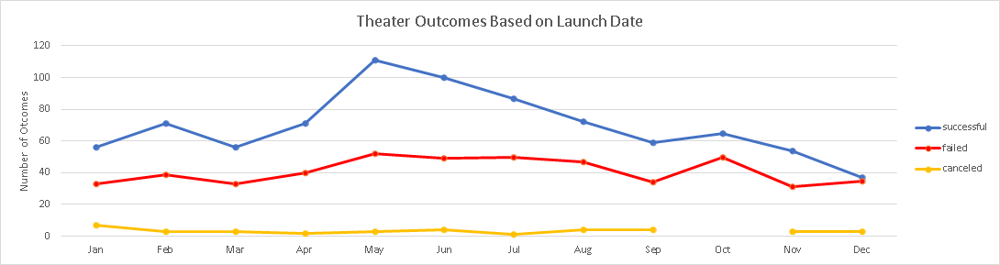
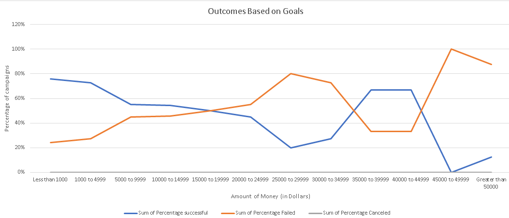

# Kickstarting with Excel

## Overview of Project

### Purpose
Our client Louise’s play *Fever* came close to its Kickstarter fundraising goal. Louise would like to know how other fundraising campaigns went based on their launch dates and funding goals.

## Analysis and Challenges

### Analysis of Outcomes Based on Launch Date
Explain how you performed your analysis

**Figure 1**: Line graph of the relationship between the campaign launch date and campaign outcomes for the theater category.

### Analysis of Outcomes Based on Goals

We created a new table based on goal amounts in increments of$5000. Then using the countifs function we collected the number of successful, failed, and canceled outcomes for each increment. Comparing the data to the total campaign outcomes per goal amount, the percentage for each outcome was created.

**Figure 2**: Line graph of the relationship between Campaign funding goal amounts and campaign outcomes.

### Challenges and Difficulties Encountered
One of the challenges faced with doing this analysis was learning how to use unfamiliar functions of excel. To analyze the data efficiently required the use of functions such as the year conversion from epoc to gregorian and countifs, as well as learning to use pivot tables to filter the data.

## Results

When looking at the graph in figure 1 you can see that the best month to start a Kickstarter campaign is in May. The worst month to start a campaign is in December. You can reasonably assume this is the case due to the holidays and that disposable income is lower. One overall observation that can be made is that the odds that your campaign will succeed are more than that of it failing. Figure 2 tells us that if we want to have a successful campaign then we will want to have our funding goal to be less than $10,000. The likelihood of a successful campaign decreases as you increase your funding goal in general.

One of the limitations of this analysis is that we did not fully utilize all the data we were given. There were no connections made directly about the length of the campaigns. A longer campaign may be more likely to be funded.  We also did not look at whether or not using the spotlight feature had any effect on the success of a campaign. A testable hypothesis would be that using the spotlight feature will result in a successful campaign. One other thing not considered in this analysis was whether or not the campaign was included as a staff pick. If you were to include all the criteria mentioned above into account, a more inclusive analysis would be achieved and more precise conclusions could be derived.

